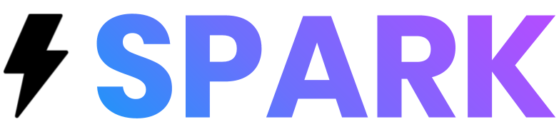

<p align="center">
	
</p>
<h3 align="center"><i>An empowering all-in-one productivity <a href="http://sparkapp.ml">web app</a></i></h3>
<p align="center">
	
	
	
	
	
	
</p>
<hr>

## 🚀 Local Development

```sh
git clone https://github.com/RGBHack/Spark.git
pip install -r requirements.txt
python app.py
```

## ✨ Diagram


<p align="center"><i>An intuitive diagram of how our content is served</i></p>

## 💻 Try it out

Video Demo: [https://youtu.be/xEvN5Cqgtfk](https://youtu.be/q-6XG5c0LZ4)<br>
DevPost: [https://devpost.com/software/spark-k6txdh](https://devpost.com/software/spark-k6txdh)<br>
Slides Presentation: [https://bit.ly/3bAfzaz](https://bit.ly/3bAfzaz)<br>

## 👨‍💻 Authors

**Safin Singh, Rohan Juneja, Aadit Gupta, Raadwan Masum**

## 🤝 Contributing

Contributions, PRs, issues and feature requests are welcome! Feel free to check out our [issues page](https://github.com/RGBHack/Spark/issues).

## ❤️ Show your support

Give this project a ⭐️ if you enjoyed it!
